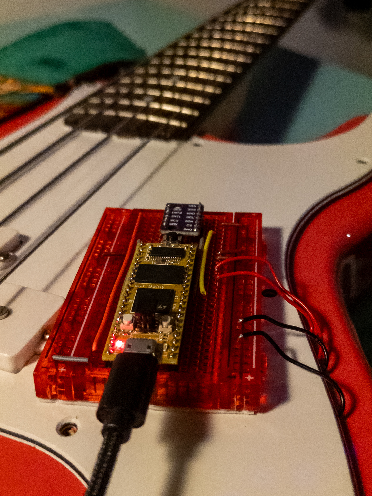

# GyroBass

**Motion-controlled audio effects unit embedded in a bass guitar body.**

Powered by a Daisy Seed (STM32H7), GyroBass maps instrument tilt to filter cutoff frequency in real-time — a hands-free wah effect driven by how you hold the guitar, with no expression pedal required.



---

## How It Works

An LSM6DS3 IMU mounted on the guitar body reads accelerometer data at 100 Hz. The tilt angle is normalized to an active range (roughly 8:30 to 11 o'clock, neck down to neck up) and used to modulate a State Variable Filter in the audio DSP chain.

Audio processing runs entirely on interrupt at 48 kHz, separate from the RTOS tasks handling sensor I/O and button input. Tilting the neck sweeps the filter from 160 Hz to ~3.5 kHz. A hardware button cycles through Low-Pass, Notch, Band-Pass, and Bypass modes.

### Signal Chain

```
Audio Input (48 kHz)
    ↓
DC Block Filter
    ↓
Input gain staging (headroom management)
    ↓
Symmetrical soft-clip overdrive
    ↓
State Variable Filter  ←  tilt value (updated at 100 Hz via FreeRTOS task)
    ↓
Filter mode select: Low-Pass / Notch / Band-Pass / Bypass
    ↓
Blend with clean signal
    ↓
Audio Output
```

### Task Architecture

| Context | Rate | Responsibility |
|---|---|---|
| Audio callback (interrupt) | 48 kHz / 4-sample blocks | Entire DSP chain |
| `Task_Sensors` (priority 2) | 100 Hz | IMU read, tilt calculation |
| `Task_UI` (priority 1) | 20 Hz | Button debounce, LED |

---

## Hardware

- **MCU**: Daisy Seed (STM32H743, 480 MHz, 64 MB SDRAM)
- **IMU**: LSM6DS3 6-axis IMU over I2C (SDA: D12, SCL: D11)
- **Audio I/O**: Onboard PCM3060 codec (stereo, 24-bit, 48 kHz)
- **UI**: Tactile button + LED on Daisy GPIO

---

## Build & Flash

### Prerequisites

- [ARM GCC Toolchain](https://developer.arm.com/downloads/-/gnu-rm) (`arm-none-eabi-gcc`)
- [OpenOCD](https://openocd.org/) with ST-Link support
- Make

### Clone

```bash
git clone --recurse-submodules https://github.com/yourusername/GyroBass.git
cd GyroBass
```

If you already cloned without `--recurse-submodules`:

```bash
git submodule update --init --recursive
```

### libDaisy SysTick patch (required)

FreeRTOS and STM32 HAL both claim `SysTick_Handler`. Before building, comment out the handler in the submodule:

In `libs/libDaisy/Core/system.cpp`, line 90 — comment out `SysTick_Handler`.

The handler is reimplemented in `src/main.cpp` to route ticks through both HAL and the RTOS scheduler. Re-apply this after any submodule update.

### Build libraries (first time only)

```bash
cd libs/libDaisy && make && cd ../..
cd libs/DaisySP && make && cd ../..
```

### Build

```bash
make        # compile to ELF/hex/bin in build/
make clean  # clean artifacts
```

### Flash via ST-Link

With ST-Link connected and OpenOCD running:

```bash
make program
```

### VSCode

Open the repo as a folder. Use `Ctrl+Shift+B` to build, or `Ctrl+P` → `Tasks: Run Task` to access build and flash tasks.

---

## Work in Progress

- **Custom State Variable Filter**: The current SVF (from DaisySP) uses a double-sampled topology with nonlinear drive — functional, but it leaves some headroom for improvement in the way resonance and frequency interact at the extremes of the tilt range. Writing a custom SVF implementation from scratch to address this and to have full control over the filter topology.
- **Custom overdrive**: Similarly, the current soft-clipper is borrowed from DaisySP. Reimplementing from scratch with a different saturation curve better suited to bass frequencies.
- **Lock-free audio buffer**: Replacing the current `std::atomic<float>` tilt handoff with a proper SPSC ring buffer between the sensor task and audio callback.
- **Drive mapped to tilt**: `drive_val` is currently fixed. Planned to map to tilt for velocity-sensitive overdrive response (range 0.7–0.9).
- **ADC knob**: Pin 21 is wired but unused — intended for real-time parameter control (blend, resonance, or drive amount).
- **Display**: SSD1306 OLED driver exists in `src/Display/` but is not yet integrated into the main application.
- **MIDI output**: Exploring monophonic pitch detection from the magnetic pickup for MIDI-over-UART, to drive a synth voice on the same MCU.

---

## Dependencies

| Library | Role |
|---|---|
| [libDaisy](https://github.com/electro-smith/libDaisy) | Hardware abstraction, audio I/O, I2C |
| [DaisySP](https://github.com/electro-smith/DaisySP) | DSP primitives: Overdrive, SVF, DcBlock |
| FreeRTOS | RTOS kernel (vendored in `src/FreeRTOS/`) |

---

## License

See [LICENSE](LICENSE).
